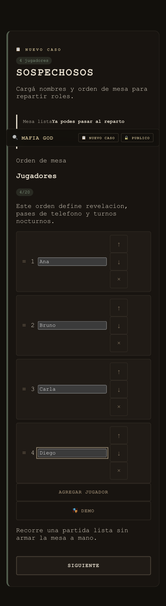
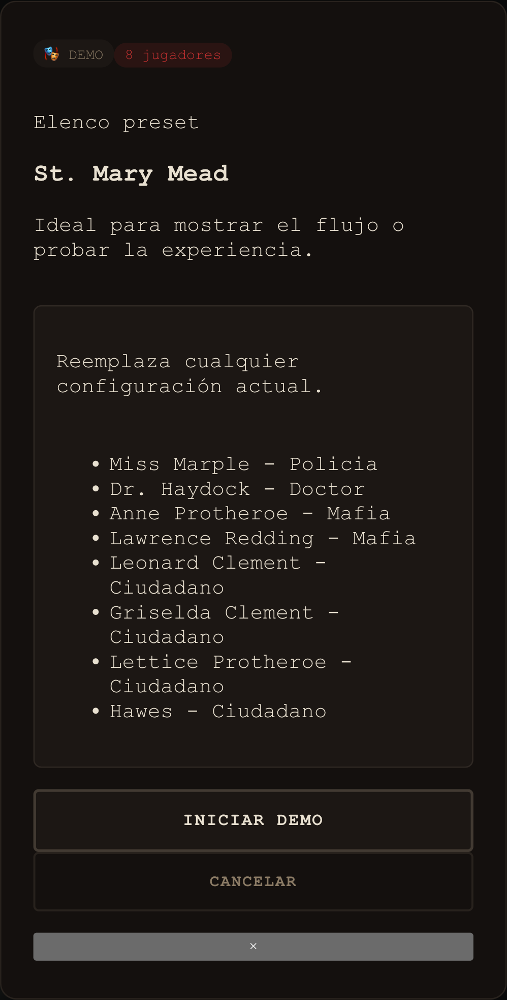
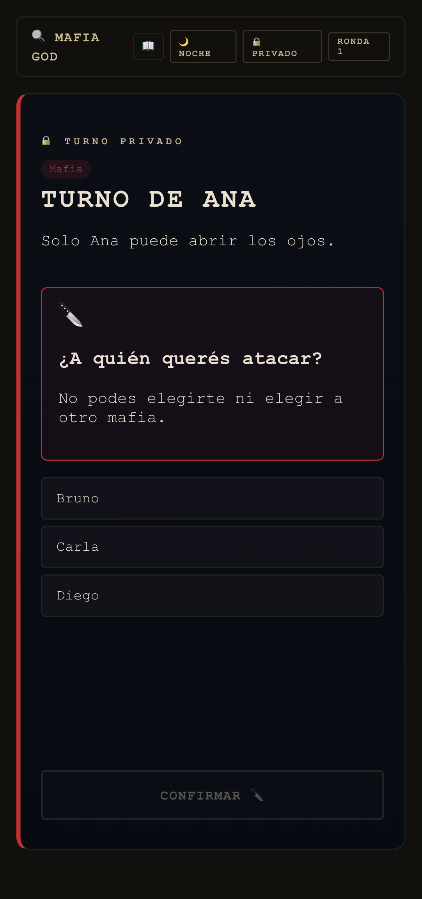
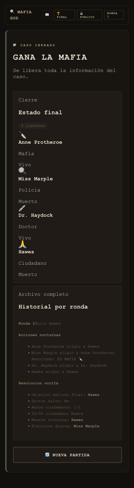
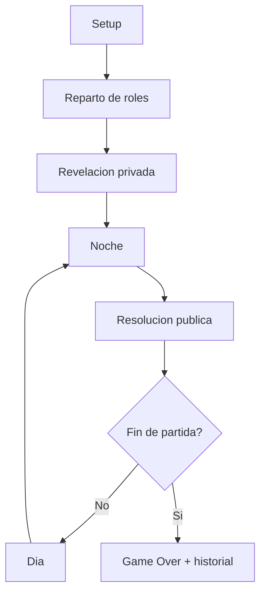

# mafia-god

<p align="center">
  <strong>La app web mobile first para jugar Mafia sin cartas y sin narrador.</strong>
</p>

<p align="center">
  Un solo celular. Un flujo claro. Cero filtraciones accidentales. Mucha paranoia bien organizada.
</p>

<p align="center">
  <a href="https://facundoraulbistolfi.github.io/mafia-god/">
    
  </a>
</p>

<p align="center">
  <a href="https://github.com/facundoraulbistolfi/mafia-god/actions/workflows/ci.yml"></a>
  <a href="https://facundoraulbistolfi.github.io/mafia-god/"></a>
  
  
  
</p>

<p align="center">
  
  
  
  
</p>

<p align="center">
  <sub>Capturas reales de <code>v0.0.1</code> en flujo mobile.</sub>
</p>

---

## Que es esto

`mafia-god` convierte una partida presencial de Mafia en una experiencia guiada desde el celular.

La app reemplaza dos fricciones tipicas del juego:

- las cartas fisicas para repartir y consultar roles;
- la necesidad de una persona dedicada a narrar cada fase.

La idea no es digitalizar la mesa completa ni reemplazar la interaccion social.
La idea es ordenar el flujo: setup, reparto, revelacion privada, noche, resolucion, dia y cierre.

## La promesa del producto

- mobile first de verdad;
- un unico dispositivo pasando de mano en mano;
- informacion privada solo cuando corresponde;
- fases claras para que nadie tenga que improvisar como moderador;
- despliegue estatico compatible con GitHub Pages.

## Estado actual

- Release objetivo actual: `v0.0.1`
- Estado de specs `0.0.1`: `closed`
- Significado: esta version ya define la primera release funcional del producto
- Regla de trabajo: cualquier cambio de comportamiento posterior debe abrir una nueva carpeta dentro de `Specs/`

## Que incluye `v0.0.1`

- configuracion de partida mobile first;
- alta de jugadores con orden circular;
- reparto de roles valido con sugerencias iniciales;
- `Modo demo` para cargar una partida fija y recorrer la app rapido;
- revelacion privada de roles, jugador por jugador;
- flujo completo de noche sin narrador;
- resolucion publica de ronda sin filtrar informacion oculta;
- fase de dia con ejecucion simple o salto a la proxima noche;
- deteccion de victoria;
- historial final completo de la partida;
- persistencia local para sobrevivir una recarga accidental;
- build estatico listo para GitHub Pages;
- CI con build, tests unitarios y Playwright end-to-end.

## Filosofia de diseño

La direccion visual de `v0.0.1` es **Expediente Policial**:

- monospace casi total;
- atmosfera de dossier oscuro;
- sellos y marcas de privacidad bien visibles;
- colores de fase muy marcados;
- una sola accion principal por pantalla cuando importa;
- interfaz pensada primero para una mesa real, no para un dashboard.

## Flujo de juego



## Principios no negociables

- la app tiene que funcionar sin cartas;
- la app tiene que funcionar sin narrador humano;
- la experiencia base tiene que ser clara en pantalla chica;
- no se asume backend propio ni infraestructura extra;
- si una idea rompe el alcance de GitHub Pages, hay que frenarse y discutirla antes.

## Quick Start

```bash
npm install
npm run dev
```

Luego abrir:

la URL que imprima Vite en terminal, normalmente `http://localhost:5173/`

## Scripts utiles

| Comando | Que hace |
| --- | --- |
| `npm run dev` | levanta Vite en modo desarrollo |
| `npm run build` | valida TypeScript y genera `dist/` |
| `npm run preview` | sirve el build de produccion localmente |
| `npm run readme:screenshots` | regenera las capturas usadas por este README |
| `npm run test:unit` | corre tests con Vitest |
| `npm run test:e2e` | corre tests end-to-end con Playwright |
| `npm test` | corre unit + e2e |

Si Vite levanta en otro puerto, las capturas del README se pueden regenerar con:

```bash
README_SCREENSHOT_BASE_URL=http://127.0.0.1:4174/ npm run readme:screenshots
```

## Stack

- `React 18`
- `TypeScript`
- `Vite`
- `Vitest`
- `Testing Library`
- `Playwright`
- `GitHub Actions`
- `GitHub Pages`

## Deploy

El proyecto esta preparado para publicarse como sitio estatico en GitHub Pages.

- el build usa `base: /mafia-god/` en produccion;
- el workflow [`deploy-pages.yml`](.github/workflows/deploy-pages.yml) despliega al hacer merge o push en `main`;
- el workflow [`ci.yml`](.github/workflows/ci.yml) verifica build + tests antes del merge.

Para dejar el circuito completo funcionando en GitHub:

1. Activar `Settings -> Pages -> Source -> GitHub Actions`.
2. Configurar branch protection o ruleset en `main`.
3. Marcar `CI / build-test-e2e` como required status check.

## Como probar la app

### Recorrido rapido

1. Abrir la app.
2. Usar `Modo demo`.
3. Confirmar el preset.
4. Recorrer la revelacion de roles.
5. Jugar una ronda completa.
6. Ver el cierre con historial.

### Validacion de desarrollo

```bash
npm run build
npm run test:unit
npm run test:e2e
```

## Estructura del repo

```text
mafia-god/
  Specs/
    product-scope.md
    0.0.1/
  src/
    app/
    domain/
    ui/
  e2e/
  .github/workflows/
```

## Specs primero, codigo despues

Este repo se trabaja de forma **spec driven**.

Orden recomendado de lectura:

1. [Specs/README.md](Specs/README.md)
2. [Specs/product-scope.md](Specs/product-scope.md)
3. [Specs/0.0.1/README.md](Specs/0.0.1/README.md)
4. [Specs/0.0.1/mvp.md](Specs/0.0.1/mvp.md)
5. [Specs/0.0.1/game-rules.md](Specs/0.0.1/game-rules.md)
6. [Specs/0.0.1/use-cases.md](Specs/0.0.1/use-cases.md)
7. [Specs/0.0.1/ux-look-and-feel.md](Specs/0.0.1/ux-look-and-feel.md)
8. [Specs/0.0.1/visual-guide.md](Specs/0.0.1/visual-guide.md)

## Norte del proyecto

Antes de aprobar una feature, la pregunta es:

> Esto ayuda a jugar Mafia en grupo desde el celular, sin cartas ni narrador, dentro de una web app hosteable en GitHub Pages?

Si la respuesta no es un "si" bastante claro, no es un cambio listo para entrar.

## Roadmap inmediato

- `v0.0.1` queda como release funcional cerrada
- la proxima iteracion debe vivir en `Specs/<nueva-version>/`
- cualquier nueva feature tiene que entrar por specs antes que por codigo

## Contribucion

Si vas a tocar el producto:

- lee primero [Agents.md](Agents.md);
- trata `Specs/` como fuente de verdad;
- no cambies comportamiento de `0.0.1` sin abrir una nueva version;
- pensa siempre en sesiones presenciales, en celular y con privacidad local.

## TL;DR

`mafia-god` es un director de partidas de Mafia para un unico celular.
Ordena la mesa, protege la informacion secreta, elimina cartas y narrador, y ya sale preparado como `v0.0.1` con CI y deploy estatico.
